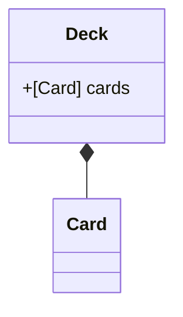
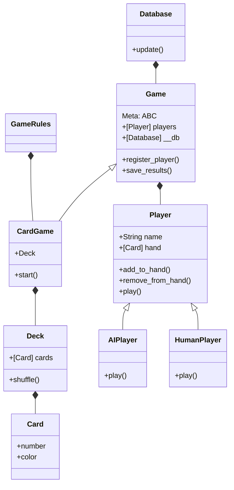
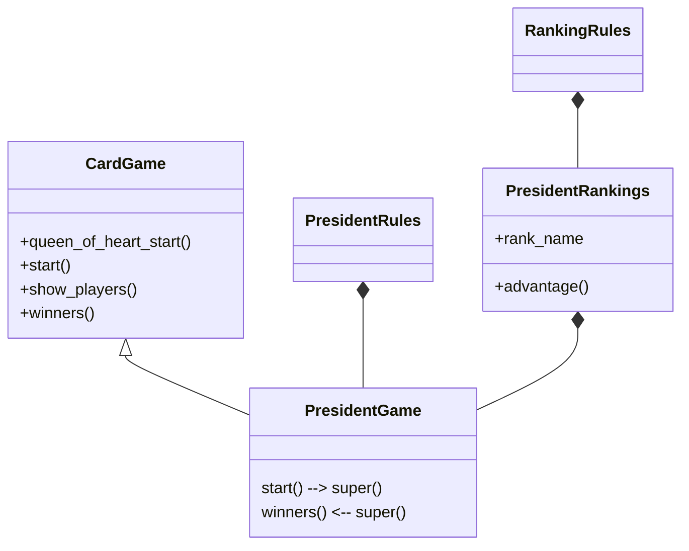
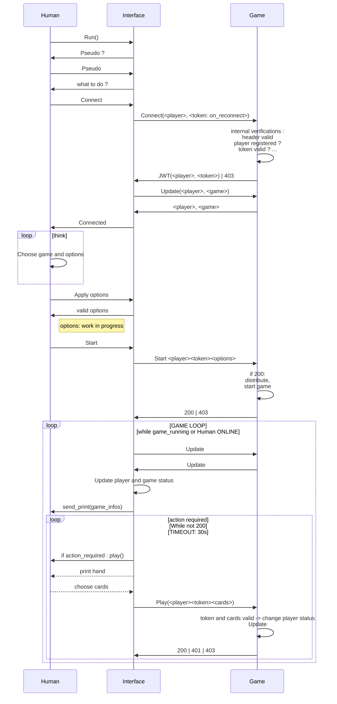
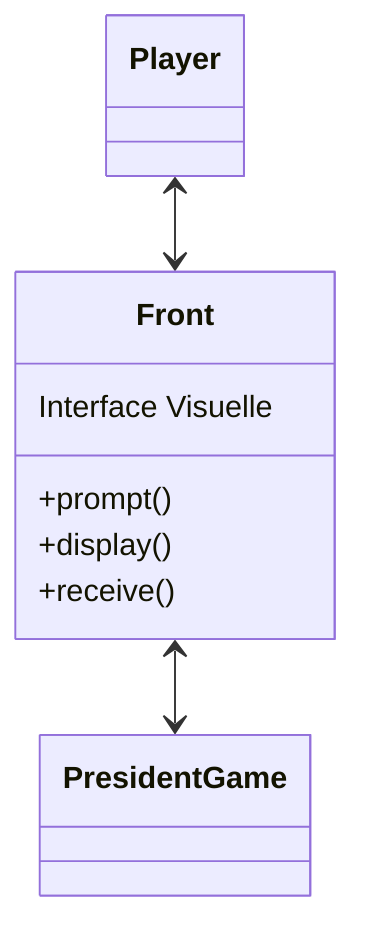

# Le jeu du président

## How to use :
```shell
# git clone https://github.com/Mistayan/President-Game.git
# cd President-Game
py setup.py --interface
```

## Test program

```shell
# git clone https://github.com/Mistayan/President-Game.git
# cd President-Game
py setup.py
venv/Scripts/python -m unittest discover -s tests
```

## If you wish to test that the game actually works using networking :

Start the server, using docker compose

```shell
docker compose up --force-recreate 
```

Then, you can connect to the newly generated server, that uses MongoDB to store games

```shell
py setup.py --interface
```

[[__TOC__]]

Le président (aussi appelé le troufion) est un jeu de cartes rapide et amusant, au cours duquel la
hiérarchie des joueurs changera à chaque manche.
Le vainqueur d'une manche devient le président, alors que le perdant est proclamé troufion.
Une fois que vous maitriserez les règles de base, vous pourrez essayer différentes
variantes de ce jeu très populaire.

Règles du jeu :

- Ce jeu se joue de 3 à 6 joueurs.
- Lors du premier tour, le joueur possédant la dame de coeur commence.
- L'ensemble des cartes sont distribuées aux joueurs de la manière la plus homogène.
- Ce jeu se joue par tours. Tant que quelqu'un peut et veut jouer, le tour continue et tourne dans
  le sens horaire.
- Le premier joueur choisit des cartes d'une même valeur et les pose sur la table.
- Suite à cela, chaque joueur doit fournir autant de cartes que le joueur précédent des cartes
  d'une valeur supérieure ou égale.
- Un joueur a le droit de sauter son tour et reprendre le tour d'après.
- Un tour est fini lorsque plus personne ne joue. C'est alors le dernier à avoir joué qui ouvre la
  manche suivante. Ou si un joueur pose un ou plusieurs deux. Ce qui mets immédiatement fin au
  tour.
- L'objectif est d'être le premier à ne plus avoir de cartes. Ce joueur est alors déclaré président
  de la manche.
- Les joueurs restants continuent à jouer jusqu'à ce qu'il n'y ait plus qu'un joueur qui ait des
  cartes en main, il est alors déclaré 'troufion'

On décide alors ou non de jouer une nouvelle manche. Ce sera le troufion qui ouvrira la partie.

## Rush 1

Générer un deck de 52 cartes.
Rédiger les méthodes magiques permettant de comparer deux cartes.



Attention, la carte la plus forte est le `2`, puis l'as, puis le `R`, `D`, `V`, `10`, `9`... .

## Rush 2

### Décomposition du problème

Le jeu du président est un __jeu__ | __de cartes__ avec certaines __regles__.<br>
Nous requérons de pouvoir sauvegarder nos données de jeu --> __DB__



### Le jeu du président

Comme annoncé, le jeu du __President__ est un __jeu de cartes__ <br>
Il possède des __règles supplémentaires__ par rapport à un jeu de cartes classique <br>
Ce jeu possède aussi son propre __système de classement des joueurs__, chaque rang ayant des
__avantages__ donnés en nombre de cartes, à échanger lors de la prochaine partie <br>
Un joueur peut jouer un __jeu de cartes__ ou le jeu du __Président__.
Le __jeu__ accepte de recevoir des cartes de la part des joueurs --> __play()__<br>
Il peut forcer les joueurs à échanger leurs cartes lors du début d'une __nouvelle partie__



## Rush 3

Implémenter une petite interface pour représenter les cartes au sein
de la console et permettre au joueur de choisir les cartes à jouer.

Il est possible de sélectionner plusieurs cartes dès lors qu'elles ont la même valeur.

```mermaid
classDiagram
    class Cli{
    StdIO (print / input)
    }
    class Game{
    (or any dependent)
    }
    class Server{
    +receive()
    +send_all()
    }
    class Interface{
        +update()
        +connect()
        +disconnect()
        +start()
    }
    class Response{
    }
    class Player{
        +play()
    }
    Cli <--> Player
    Cli <--> Game
    Interface <-- Cli
    Server <|-- Game
    Response *-- Server
    Server *-- Interface

```

### Table temporelle :



Une vérification doit être mise en place pour voir si le choix de l'utilisateur est correct.

## Rush 4

Implémenter une interface graphique (TK ?)
Faire communiquer l'interface d'un joueur au jeu



## Avancements :

- [x] Présence d'un fichier `requirements.txt`
- [x] Pertinence du fichier `Readme.md`
- [x] Gestion de GIT
- [x] Doctrings
- [x] Nommage méthodes/classes/variables
- [x] Un joueur face à 3 IA
- [x] Generation des cartes
- [x] Validation des tests unitaires
- [x] Présentation CLI
- [ ] Présentation graphique aboutie
- [x] Fonctionnalités avancées de jeu du président

> Réalisation des fonctionnalités en TDD / CDD.

- [x] Présentation des joueurs en début de partie et affichage du nombre de cartes que chaque
  joueur a en main.
- [x] Le déroulé d'une manche.
    - Chaque utilisateur doit fournir s'il peut (ou veut) la quantité de cartes demandées.
    - Le vainqueur d'une manche ouvre la manche suivante
    - Il existe un gagnant (celui qui a vidé sa main) et un perdant (le dernier joueur a encore
      des cartes en main).
- [x] Gestion d'une fin et lancement d'une nouvelle partie, affichage des scores
- [x] Le mécanisme de troufion et de président
    - En fonction du nombre de joueurs, et de la partie précédente il peut exister :
        - Un président et un troufion si 3 joueurs (1 carte)
        - Ajout d'un vice président et d'un vice troufion si 4+ (2 cartes (président <-> trouffion)
          , 1 carte (vice <-> vice)
    - Le troufion doit donner sa meilleure carte, le président choisit quelle carte donner
- [x] Intelligence artificielle
    - Ajouter un raisonnement simple en plus du raisonnement déjà existant.

# TODO schema mermaid de sécurité timeline

### TODO

# Définition d'un standard pour dynamiser la création des routes du jeu :

Afin de continuer sur le principe de découpage des objectifs de chaque module,
Nous avons donc défini des routes standards à tout type de jeux, puis chaque style de jeu ouvrira les portes de nouveaux sous-parties des jeux.
Dans notre cas initial, nous avons Un SERVEUR, qui exécute un JEU, de CARTES du PRESIDENT.
Chaque héritage nous donne accès à de nouvelles fonctionnalités, câblées sur les logiques du jeu en cours d'exécution (instancié, et hérité de SERVER).

```python
# models/games/card_games/card_game.py
@self.route(f"/{Play.request['message']}/{Play.REQUIRED}",
            methods=(Play.request['methods']))


def play(player, plays):
    player: Human = self.get_player(player)
    if not player.is_human:
        raise CheaterDetected("An AI cannot use this method...")
```
Chaque route spécifie des sécurités, empêchant un joueur de contrôler les actions d'une IA, ou toute autre action qui ne serait pas autorisée.


```python
# models/networking/responses.py
class Play(Restricted):
    REQUIRED = "<player>/<plays>"
    request: dict = {'methods': ("POST",), 'message': "Play", 'plays': []}
    POSSIBLE_VALUES = GameRules.values
    POSSIBLE_COLORS = GameRules.COLORS
    response: dict = {'token': None, 'player': None, "play": []}
```
Comme on peut le constater, l'action "Play" est restricted.
Cela signifie que notre serveur attendra un token d'authentification valide pour le joueur effectuant la requête.
Ce token est dispensé à chaque joueur, à sa connexion initiale, il est UNIQUE.


# Code quality

```shell
pylint $(git ls-files '*.py')
# Your code has been rated at 7.73/10 (previous run: 7.73/10, +0.00) # 21/11/2022 20-38-00
# Your code has been rated at 7.82/10 (previous run: 7.56/10, +0.26) # 21/11/2022 21-37-00
```
```shell
./venv/Scripts/pylint ./models
# Your code has been rated at 7.83/10 (previous run: 7.83/10, +0.00) # 21/11/2022 21-38-00
# Your code has been rated at 8.28/10 (previous run: 8.16/10, +0.11) # 08/12/2022 12:05
# Your code has been rated at 9.34/10 (previous run: 8.71/10, +0.63) # 08/12/2022 15:15

```
```shell
./venv/Scripts/pylint ./tests
# Your code has been rated at 9.18/10 (previous run: 8.99/10, +0.20) # 08/12/22 11:10
# Your code has been rated at 9.32/10 (previous run: 9.24/10, +0.08) # 08/12/22 11:17

```
