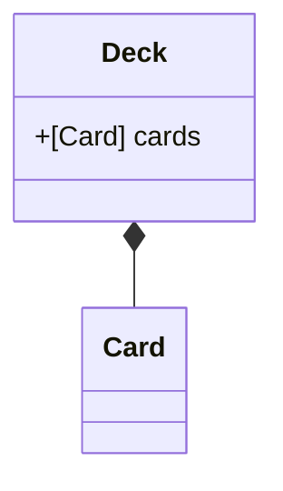
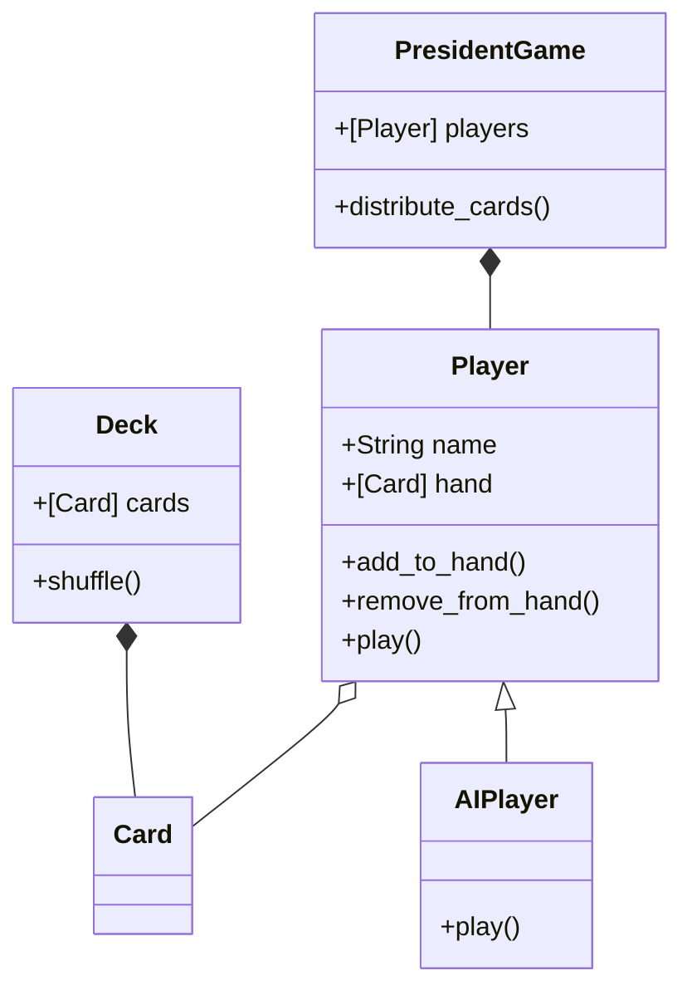

# Python Exercice : Le jeu du président

Le président (aussi appelé le troufion) est un jeu de cartes rapide et amusant, au cours duquel la hiérarchie des joueurs changera à chaque manche. Le vainqueur d'une manche devient le président, alors que le perdant est proclamé troufion. Une fois que vous maitriserez les règles de base, vous pourrez essayer différentes variantes de ce jeu très populaire.

Règles du jeu : 
 - Ce jeu se joue de 3 à 6 joueurs.
 - Lors du premier tour, un joueur aléatoire est défini pour commencer.
 - L'ensemble des cartes sont distribuées aux joueurs de la manière la plus homogène.
 - Ce jeu se joue par manches. Tant que quelqu'un peut et veut jouer, la manche continue et tourne dans le sens horaire. 
 - Le premier joueur choisit des cartes d'une même valeur et les pose sur la tables.
 - Suite à celà, chaque joueur doit fournir autant de cartes que le joueur précédent des cartes dun' valeur supérieure ou égale.
 - Un joueur a le droit de sauter son tour et reprendre le tour d'après.
 - Un tour est fini lorsque plus personne ne joue. C'est alors le dernier à avoir joué qui ouvre la manche suivante. 
 - L'objectif est d'être le premier à ne plus avoir de cartes. Ce joueur est alors déclaré président.
 - Les joueurs restants continuent à jouer jusqu'à ce qu'il n'y ait plus qu'une joueur qui ait des cartes en main, il est alors déclaré 'troufion'

## Exercice 1
Générer un deck de 52 cartes.
Rédiger les méthodes magiques permettant de comparer deux cartes.

Attention, la carte la plus forte est le `2`, puis l'as, puis le `R`, `D`, `V`, `10`, `9`...
.Afin de vous assurer que le code généré fonctionne. Executez
 les tests suivants. 
 
 `python test_exercice1.py`

## Exercice 2
Afin de pouvoir jouer au président, il va être nécessaire d'implémenter la
 classe d'un joueur. Et de distribuer les cartes aux joueurs. 
 
Afin de faciliter les tests, nous allons considérer qu'il y a trois joueurs
 présents autour de la table. 
 
Ainsi, dans cette étape, implémentez les classes `PresidentGame` et `Player`.

.Afin de vous assurer que le code généré fonctionne. Executez
 les tests suivants. Adaptez les si vos classes ont des méthodes différentes. 
 
 `python test_exercice2.py`

 
## Exercice 3
Nous avons maintenant une partie qui peut se lancer. N'ayant pas d'interface
 graphique pour le moment, nous allons réaliser les échanges avec le joueur
  par le biais de la console. 

A partir du fichier `main.py`, implémentez une petite interface pour représenter les cartes au sein de la console, et permettre au joueur de choisir les cartes à joueur. 
 
 Il est possible de sélectionner plusieurs cartes dès lors qu'elles ont la même valeur. 
 
 Une vérification doit être mise en place pour voir si le choix de l
 'utilisateur est correct.
  

 ## Barème : 
 - /1   Présence d'un fichier `requirements.txt` 
 - /1   Pertinence du fichier `Readme.md`
 - /2   Gestion de GIT
 - /2   Doctrings
 - /2	Nommage méthodes/classes/variables
 - /2	Un joueur face à 3 IA
 - /2	Generation des cartes
 - /2	Validation des tests unitaires
 - /2	Présentation graphique
 - /1	Présentation graphique aboutie
 - /3	Fonctionnalités avancées de jeu du président

 ## Suite des exercices à réaliser.
 
 > Réaliser l'ensemble de ces fonctionnalités en TDD. 
 
 > Les fichiers de tests sont là pour celà. 

> Dans un premier temps, executez les tests existants pour voir s'ils fonctionnent. 
 Réparez les si nécessaire.
 
 > Puis implémentez une nouvelle série de tests pour implémenter 
 une des fonctionnalités listées ci-dessous.

 > Passer par l'étape d'une modélisation UML permets souvent de clarifier l'approche face aux implémentations à réaliser.

> Ceci vous oblige à devoir d'abord réfléchir sur la conception des objets. 
 Et leurs interactions.
 
- [ ] Présentation des joueurs en début de partie, et affichage du nombre de cartes que chaque joueur a en main.
- [ ] Le déroulé d'une manche. 
    - Chaque utilisateur doit fournir s'il peut (ou veut) la quantité de cartes demandées.
    - Le vainqueur d'une manche ouvre la manche suivante
    - Il existe un gagnant (celui qui a vidé sa main) et un perdant (le dernier joueur a encore avoir des cartes en main).
 - [ ] Gestion d'une fin et lancement d'une nouvelle partie, affichage des scores
 - [ ] Le mécanisme de troufion et de président
    - En fonction du nombre de joueurs, et  de la partie précédente il peut exister : 
        - Un président et un troufion si 3 ou 4 joueurs (1 carte)
        - Ajout d'un vice président et d'un vice troufion si 5+ (2 cartes (président <-> trouffion), 1 carte (vice <-> vice)
    - Le troufion doit donner sa meilleure carte, le président choisit quelle carte donner
 - [ ] Interface graphique
 - [ ] Intelligence artificielle 
    - Ajoutez un raisonnement simple en plus du raisonnement déjà existant.

