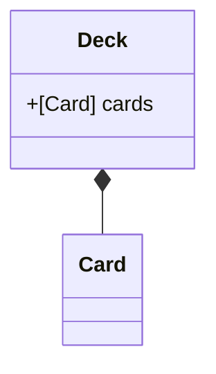
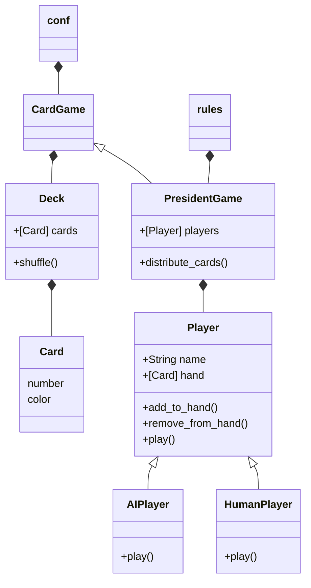
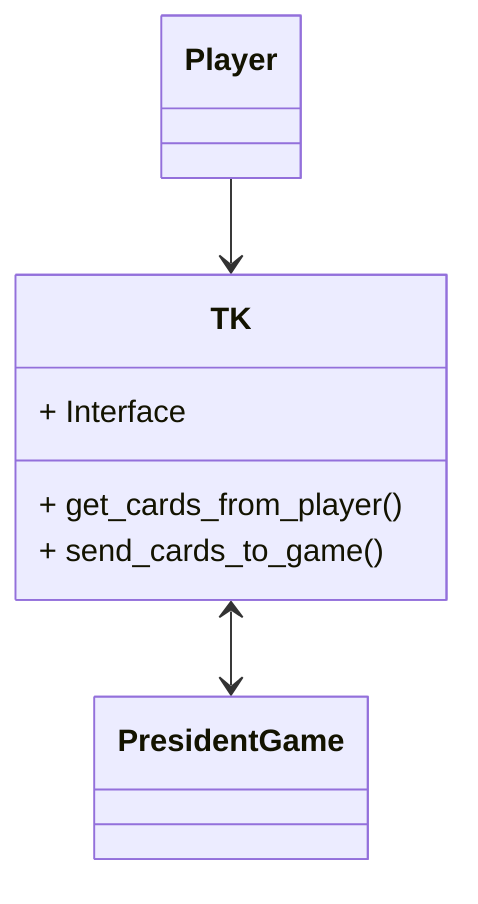

# Le jeu du président

Le président (aussi appelé le troufion) est un jeu de cartes rapide et amusant, au cours duquel la
hiérarchie des joueurs changera à chaque manche.
Le vainqueur d'une manche devient le président, alors que le perdant est proclamé troufion.
Une fois que vous maitriserez les règles de base, vous pourrez essayer différentes
variantes de ce jeu très populaire.

Règles du jeu :

- Ce jeu se joue de 3 à 6 joueurs.
- Lors du premier tour, le joueur possédant la dame de coeur commence.
- L'ensemble des cartes sont distribuées aux joueurs de la manière la plus homogène.
- Ce jeu se joue par tours. Tant que quelqu'un peut et veut jouer, le tour continue et tourne dans
  le sens horaire.
- Le premier joueur choisit des cartes d'une même valeur et les pose sur la table.
- Suite à cela, chaque joueur doit fournir autant de cartes que le joueur précédent des cartes
  d'une valeur supérieure ou égale.
- Un joueur a le droit de sauter son tour et reprendre le tour d'après.
- Un tour est fini lorsque plus personne ne joue. C'est alors le dernier à avoir joué qui ouvre la
  manche suivante. Ou si un joueur pose un ou plusieurs deux. Ce qui mets immédiatement fin au
  tour.
- L'objectif est d'être le premier à ne plus avoir de cartes. Ce joueur est alors déclaré président
  de la manche.
- Les joueurs restants continuent à jouer jusqu'à ce qu'il n'y ait plus qu'un joueur qui ait des
  cartes en main, il est alors déclaré 'troufion'

On décide alors ou non de jouer une nouvelle manche. Ce sera le troufion qui ouvrira la partie.

## Rush 1

Générer un deck de 52 cartes.
Rédiger les méthodes magiques permettant de comparer deux cartes.

Attention, la carte la plus forte est le `2`, puis l'as, puis le `R`, `D`, `V`, `10`, `9`... .

## Rush 2

## Rush 3

Implémenter une petite interface pour représenter les cartes au sein
de la console et permettre au joueur de choisir les cartes à jouer.

Il est possible de sélectionner plusieurs cartes dès lors qu'elles ont la même valeur.

Une vérification doit être mise en place pour voir si le choix de l'utilisateur est correct.

## Rush 4

Implémenter une interface graphique (TK ?)
Faire communiquer l'interface d'un joueur au jeu

## Avancements :

- [x] Présence d'un fichier `requirements.txt`
- [x] Pertinence du fichier `Readme.md`
- [x] Gestion de GIT
- [x] Doctrings
- [x] Nommage méthodes/classes/variables
- [x] Un joueur face à 3 IA
- [x] Generation des cartes
- [x] Validation des tests unitaires
- [x] Présentation CLI
- [ ] Présentation graphique aboutie
- [x] Fonctionnalités avancées de jeu du président

> Réalisation des fonctionnalités en TDD / CDD.

- [x] Présentation des joueurs en début de partie et affichage du nombre de cartes que chaque
  joueur a en main.
- [x] Le déroulé d'une manche.
    - Chaque utilisateur doit fournir s'il peut (ou veut) la quantité de cartes demandées.
    - Le vainqueur d'une manche ouvre la manche suivante
    - Il existe un gagnant (celui qui a vidé sa main) et un perdant (le dernier joueur a encore
      des cartes en main).
- [x] Gestion d'une fin et lancement d'une nouvelle partie, affichage des scores
- [x] Le mécanisme de troufion et de président
    - En fonction du nombre de joueurs, et de la partie précédente il peut exister :
        - Un président et un troufion si 3 joueurs (1 carte)
        - Ajout d'un vice président et d'un vice troufion si 4+ (2 cartes (président <-> trouffion)
          , 1 carte (vice <-> vice)
    - Le troufion doit donner sa meilleure carte, le président choisit quelle carte donner
- [x] Intelligence artificielle
    - Ajouter un raisonnement simple en plus du raisonnement déjà existant.

# Comment utiliser le logiciel :

> Il est fortement recommandé d'utiliser un environnement virtuel :
> > python -m venv venv  
> > .\venv\Scripts\activate

> pip install -r requirements.txt
>
> Modifier rules.py pour adapter les regles du jeu
>
> python main.py  
